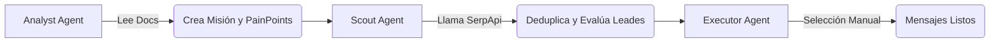

# NRSMarketing: Avance de la Fundación del Backend 🚀

Completé la construcción principal de la infraestructura y el motor de inteligencia artificial de NRSMarketing. El sistema ahora tiene una base sólida apoyada en arquitectura Laravel 11.

A continuación, un resumen técnico de lo que acabo de implementar:

### 1. Sistema de Modelos y Migraciones (Completado)
La base de datos fue creada y cuenta con las tablas para soportar el ciclo de vida continuo:
- **`Campaigns` y `CampaignRuns`**: Permiten rastrear ejecuciones a través del tiempo.
- **`AgentExecutions` y `ApiUsageLogs`**: Mantienen un registro estricto del uso de Tokens y del costo económico asociado al presupuesto (USD 5 limit).
- **`ContextFiles`**: La capa de abstracción para almacenar en la base de datos la meta-data de los archivos `.md` y `.json` estáticos que se van a guardar localmente.

### 2. Capa de Servicios
- **Gemini Service**: Ya está integrado usando Google API y maneja nativamente tanto el modelo `Gemini-2.5-Pro` como `Gemini-2.5-Flash`.
- **SerpApi Service**: Creado para realizar las búsquedas nativas y orgánicas a la web, e incluso puede realizar búsquedas basadas geográficamente con Maps.
- **Context Manager**: Administra donde y cómo se leen los archivos de sistema para entregarles contexto a los Agentes.
- **Budget Service**: Revisa que las llamadas a la API nunca excedan tu presupuesto de $5 y puede alertarte si se aproxima al 80%.

### 3. Agentes Creados y Listos para la UI

1. **`AnalystAgent`**: Usa *Gemini Pro* y su context limit alto para leer PDFs y docs, estructurarlos y extraer "Puntos de Dolor".
2. **`ScoutAgent`**: Ejecuta consultas de Google a través de llamadas de sistema *SerpAPI*, unificando los dominios repetidos para rankear a los clientes y evaluarlos usando *Gemini Flash*.
3. **`ExecutorAgent`**: Genera los copy de correo, o los draft fields en espera de tu aprobación manual de cual canal usar.

### Próximos Pasos (Frente de Usuario - Frontend)
Ya que el backend está firme en el suelo, necesitamos pasar a construir la UI para que puedas comenzar a usar el sistema.

¿Con qué parte del frontend te gustaría que comencemos?
- **Opcion A**: Empezar con el **CRUD de Productos** y Carga de manuales.
- **Opción B**: Interfaz Principal y Layout (Sidebar de navegación + Chat Global lateral).
- **Opción C**: Flujo y Wizard de *Campaign* (Donde la UI corre al Analista y edita la Misión de Búsqueda).
